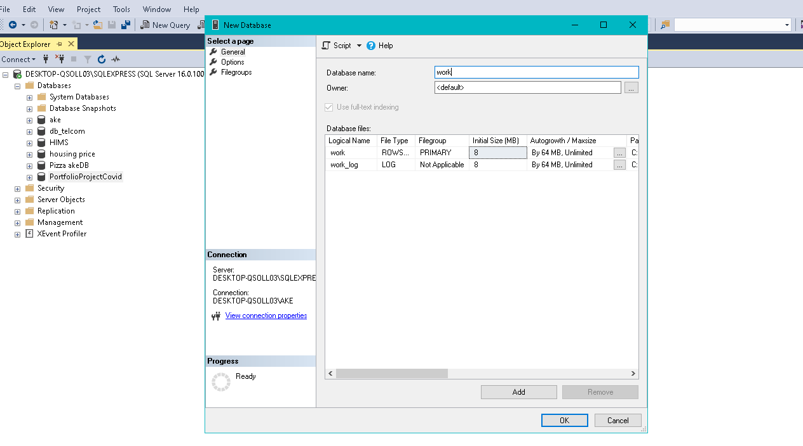
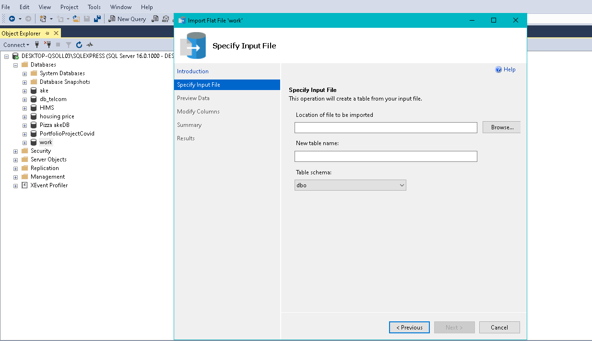
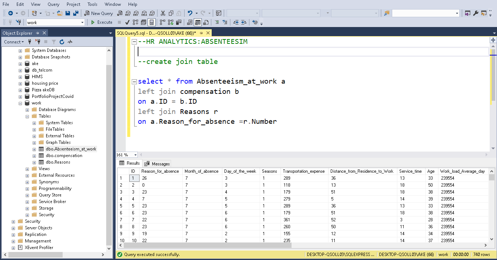
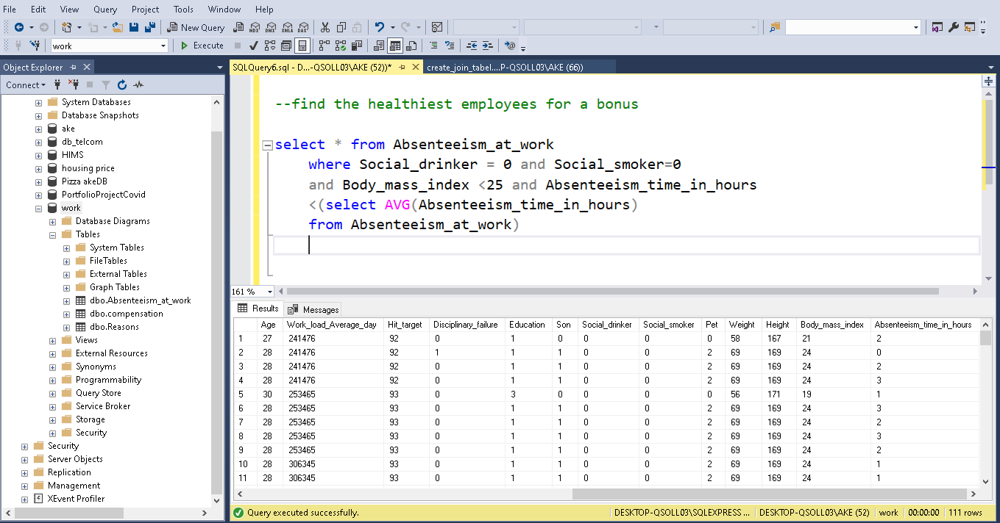

# HR_SQL_Server_Analytics

These project focuses on using employee data to promote a healthy lifestyle through a bonus program and compensation analysis.
- HR department requests a list of healthy individuals with low absenteeism       for a $1,000 bonus program and a calculation of wage increases for non-smokers

## Steps of Data Analysis
### Step 1. Database Creation and Data Import
- The project begins with the creation of a database in Microsoft SQL Server Studio.

  

- A new database named "work" is created, and data is imported from flat CSV files into tables.
- right click on a new data base and click on import flat file instruction and browse 

  

#### Table Structure
- The first table includes columns such as reasons for absence, month of absence, age, workload, and absenteeism.
- A second table is created to define the reasons for absence, and a third table for employee salary.

### Step 2. Join the Tables
- SQL queries are developed to join the tables and analyze the data.
- The main table is the absenteeism table, which is joined with the compensation and reasons tables.

  

### Step 3. Identify the Healthiest Employees
- Healthy employees are defined as non-smokers and non-drinkers, with a BMI under 25 and lower than average absenteeism

  

### Step 4. Compensation Calculation for Non-Smokers
- The total number of non-smokers is counted, and the budget for wage increases is calculated based on the number of non-smokers and total hours worked

  ``
  
- The increase per hour for non-smokers is determined, leading to an annual compensation

### Step 5. Query Optimization
The SQL queries are optimized to select only the necessary columns instead of using wildcards, which helps avoid duplicate columns in the final dataset 
  

